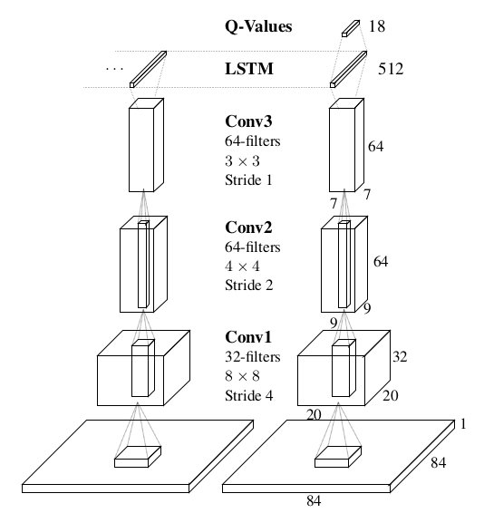

# [Deep Recurrent Q-Learning For Partially Observable MDPs](https://arxiv.org/pdf/1507.06527.pdf)

## Summary

Investigating the effects of adding recurrency to a Deep Q-Network by replacing the first post-convolutional fully-connected layer with a recurrent LSTM resulting in Deep Recurrent Q-Network.

DRQN replicates DQNs performance on standard Atari games and partially observed equivalents featuring flickering game screens. 

DRQNs performance scales as a function of observability but when trained on full observations and evaluared with partial observations, DRQNs performance degrades less than DQNs.

## Background

Since DQN is trained using an input consisting of the last four states the agent has encountered, DQN will be unable to master games that require the player to remember events more distant than four screens in the past. 

Put differently, any game that requires a memory of more than four frames will appear non-Markovian because the future game states (and rewards) depend on more than just DQN’s current input. Instead of a Markov Decision Process (MDP), the game becomes a Partially-Observable Markov Decision Process (POMDP).

### Deep Q-Learning

Reinforcement Learning is concerned with learning control policies for agents interacting with unknown environments. The environments are often formalized as a Markov Decision Process described by a 4-tuple . At each timestep t, an agent interacting with the MDP observes a state  and choses action  which determines the reward  and the next state . 

Q-learning is a model-free off-policy algorithm for estimating long-term expected return of executing an action from a given state. A hight Q-value indicates an action a is judged to yeild better long-term results in a state s. Q-values estimate towards the observed reqard plus the max Q-value over all actions  in the resulting state :

The model is a neural network parameterized by weights and biases collectively denoted as . Q-values are estimated by querying the output nodes of the network after performing a forward pass given a state input. Updates are made to the parameters of the network to minimize a differentiable loss function  as .

Deep Q-Learning uses three techniques to stabilize the learning
* Experiences  are recorded in a replay memory  and then sampled uniformly. 
* A seperate target network  provides update targets to the main network
* An adaptive learning rate such as RMSProp which maintains a per-parameter learning rare and adjusts this to history of gradient updates.

### Partial Observability

A Partially Obervable Markov Decision Process (POMDP) captures the dynamics of many real-world environments by explicitly acknowledgubg the sensations received by the agent. A POMDP can be described as a 6-tuple .  are the states, actions, transitions, and rewards as before, except now the agent is no longer privy to the true system state and instead receives an observation , which is generated from the underlying system state according to the probability distribution .

Vanilla Deep Q-Learning has no explicit mechanisms for deciphering the underlying state of the POMDP.

## Architecture

The architecture of DQN is modified minimally by replacing the first fully-connected layer with a recurrent LSTM layer of the same size. The architecture of DRQN takes a single 84×84 processed image. The image is processed by three convolutional layers and the outputs are fed to the fully connected LSTM layer. Finally, a linear layer outputs a Q-Value for each action. 

During training, the parameters for both the convolutional and recurrent portions of the network are learned jointly from scratch. 

### Stable Recurrent Updates

Updating a recurrent, convolutional network requires each backward pass to contain many time-steps of game screens and target values. The LSTM's initial hidden states may be zero or carried from the previous values.

* **Bootstrapped Sequential Updates**: Episodes are selected randomly from the replay memory and updates begin at the beginning of the episode and proceed forward through time to the conclusion of the eposide. The targets at each timestep are generated from the target Q-network, . The RNN’s hidden state is carried forward throughout the episode.

* **Bootstrapped Random Updates**: Episodes are selected randomly from the replay memory and updates begin at random points in the episode and proceed for only unroll iterations timesteps (e.g. one backward call). The targets at each timestep are generated from the target Q-network, . The RNN’s initial state is zeroed at the start of the update.

Experiments indicate that both types of updates are viable and yield convergent policies with similar performance across a set of games.