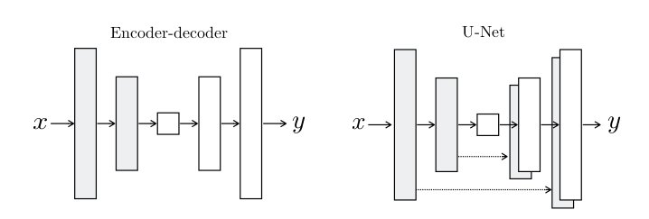
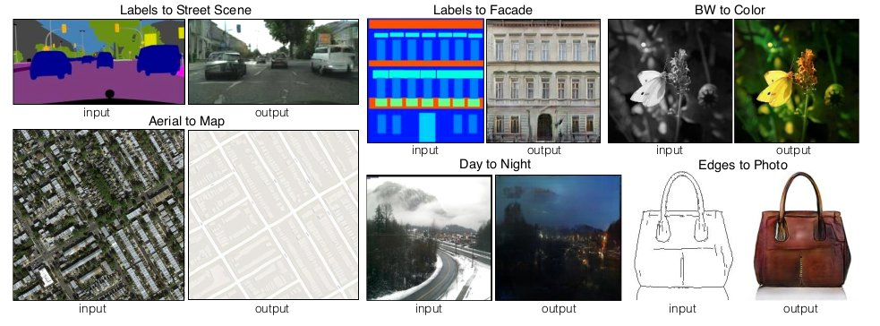

# [Image-to-Image Translation with Conditional Adversarial Networks](https://arxiv.org/pdf/1611.07004.pdf)

## Summary 

General-purpose solution to image-to-image translation problems.

### Objective

The generator G is trained to produce outputs that cannot be distinguished from “real” images by an adversarially trained discriminator, D, which is trained to do as well as possible at detecting the generator’s “fakes”. 

For pix2pix the objective is not just to minimise the GAN loss, i.e.,  but also to minimise the .

## Architecture

### Generator

Many solutions to problems in this area have used an encoder-decoder network. In such a network, the input is passed through a series of layers that progressively downsample, until a bottleneck layer, at which point the process is reversed.
To give the generator a means to circumvent the bottleneck for information like this, skip connections are added, following the general shape of a **U-Net**.

### Discriminator

In generic GANs, the discriminator cannot observe the input vector. In case of Conditional GANs, the Discriminator observes both the input as well as the Generated Vector.

Discriminator must is motivated to model high-frequency structures and L1 is relied for low-frequency structures. The discriminator tries to classify if each nxn patch. Ideal found is 70x70.

## Results

## Implementation

* [Original Implementation](https://github.com/junyanz/pytorch-CycleGAN-and-pix2pix)

* [Reference](https://github.com/mrzhu-cool/pix2pix-pytorch)